[Current stock](https://docs.google.com/spreadsheets/d/1mCMbyp-5vMcfMzT4ovZjpsKi10JSWpNIOFcre1nF27s/edit?usp=sharing)

# Bill Of Material (BOM)

| Denomination                  | Qty | Unit Price | Supplier        | Image | Remarks |
|-------------------------------|-----|-------|-----------------|-------| ------- |
| 12V 10A power supply 100V-265V| 1   | 17    | [ebay](http://www.ebay.com/itm/161929667263) |  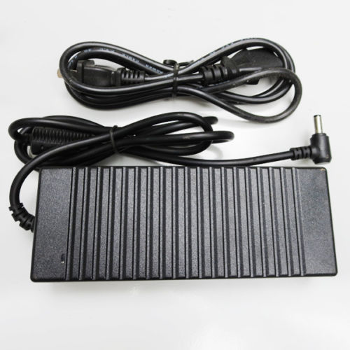 | |
| Magnetic Stirrer bar 5cm      | 1   | 3.6   | [ebay](http://www.ebay.com/itm/332037093368) |  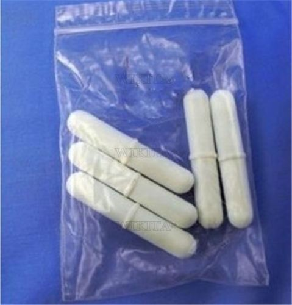 | |
| MK3 heating plate             | 1   | 12.3  | [aliexpress](https://www.aliexpress.com/item/3D-printer-heatbed-Heat-bed-MK3-standard-aluminum-plate-3mm-hot-bed-Free-shipping/1941676934.html?spm=2114.13010608.0.0.eVVdIm) |  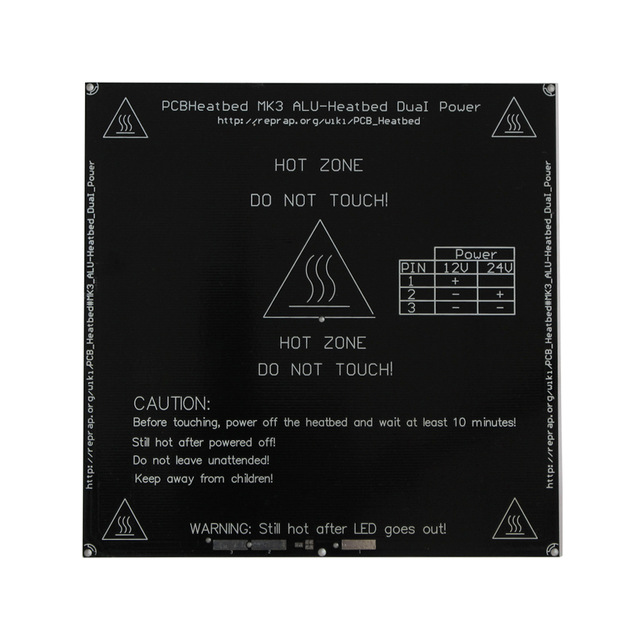 | |
| Plexiglass 600 x 500 x 6 mm   | 1   | 25    | [Plexiglass.ch](https://roehmschweiz.ch/fr/produits/plaques/plexiglas/xt-allround/incolore-0a000/)  | |
| Plexiglass 120OD 114ID 150 mm | 1   | 6     | [Plexiglass.ch](https://roehmschweiz.ch/fr/produits/tubes-batons/tubes/plexiglas/incolore-xt-0a070-110-mm/) |   | |
| Aluminium cylinder base       | 1   | 10    | Need to check price !!!| |
| PCB                           | 1   | 5     | [PCB way]()
| Miscellaneous small material  | 1   | 5     |

## Microcontroller

| Denomination                  | Qty | Unit Price | Supplier        | Image | Remarks |
| ----------------------------- | --- | ---------- | --------------- | ----- | ------- |
| Atmega32U4 44TQFP             | 1   | 3.6        | [aliexpress](https://www.aliexpress.com/item/10pcs-lot-ATMEGA32U4-AU-ATMEGA32U4-TQFP-44-IC-8-bit-Microcontroller-with-16-32K-Bytes-of/32720185776.html?spm=2114.13010608.0.0.Brw1qI) | 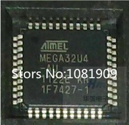 | |
| Capacitor 100 nF 0805         | 4   | 0.01       |                      |
| Capacitor 22 pF 0805          | 2   | 0.02       |                      |
| Crystal 8MHz 5032             | 1   | 0.25       | [ebay](http://www.ebay.com/itm/10PCS-8M-8-000M-8MHz-8-000MHz-Passive-Crystal-5032-5mm-3-2mm-SMD-2PIN-/331220809625?hash=item4d1e4c7799) |
| Resistor 1M 0805              | 1   | 0.01       |                      |
| Resistor 10k 0805             | 2   | 0.01       |                      |

## Power

| Denomination                  | Qty | Unit Price | Supplier             |
| ----------------------------- | --- | ---------- | -------------------- |
| Led Red 0805                  | 2   | 0.01       |                      |
| Resistor 1k 0805              | 1   | 0.01       |                      |
| Resistor 10k 0805             | 1   | 0.01       |                      |
| Power socket DC 5.5x2.5       | 1   | 0.2        | [aliexpress](https://www.aliexpress.com/item/Big-Discount-10pcs-DC-Power-Supply-Female-Jack-Socket-5-5-x-2-5mm-Barrel-Type/32406071366.html?spm=2114.30010308.3.2.fdXBrh&ws_ab_test=searchweb0_0,searchweb201602_3_10065_10068_10000009_10084_10083_10080_10082_10081_10060_10062_10056_10055_10037_10054_10059_10032_10099_10078_10079_10077_10000012_426_10103_10073_10102_10000015_10096_10052_10053_10107_10050_10106_10051,searchweb201603_1,afswitch_3_afChannel,single_sort_0_default&btsid=359acd27-d1e9-45e2-ac8a-c8276f44f4d0)                     |
| Capacitor 100 nF 0805         | 2   | 0.01       |                      |
| Capacitor 10 uF 0805          | 4   | 0.01       |                      |
| Schottky 1N581 1206           | 3   | 0.03       | [ebay](http://www.ebay.com/itm/121381924838?_trksid=p2060353.m2749.l2649&ssPageName=STRK%3AMEBIDX%3AIT)|
| LDO MCP1703 3.3v - SOT223     | 1   | 0.03       | [aliexpress](https://www.aliexpress.com/item/FREE-SHIPPING-MCP1703T-5002E-DB-MCP1703T-5002-MCP1703T-MCP1703-1703-SOT223-3-20PCS/32762396595.html?spm=2114.30010308.3.11.xKbAqb&ws_ab_test=searchweb0_0,searchweb201602_3_10065_10068_10000009_10084_10083_10080_10082_10081_10060_10062_10056_10055_10037_10054_10033_10059_10032_10099_10078_10079_10077_10000012_426_10103_10073_10102_10000015_10096_10052_10053_10107_10050_10106_10051,searchweb201603_1,afswitch_3_afChannel,single_sort_0_default&btsid=ef49b3f4-8176-408d-a7fd-03e2827db7a2) |

## Communication

| Denomination                  | Qty | Unit Price | Supplier             |
| ----------------------------- | --- | ---------- | -------------------- |
| Led Green 0805                | 2   | 0.01       |                      |
| Led Yellow 0805               | 2   | 0.01       |                      |
| Led Blue 0805 (blink)         | 1   | 0.01       |                      |
| Resistor 1k 0805              | 5   | 0.01       |                      |
| Resistor 10k 0805             | 3   | 0.01       |                      |
| FPC 8-pin 1mm AWM 20624       | 1   | 0.16       | [aliexpress](https://www.aliexpress.com/snapshot/7326978877.html?orderId=72887395416335&productId=32468149160)                |
| RJ-11 connector 6P6C (RJ12)   | 2   | 0.1        | [aliexpress](https://www.aliexpress.com/item/100PCS-RJ11-socket-Gray-RJ11-telephone-90-degrees-6pin-crystal-female-6p6c-socket/32778483833.html?spm=2114.30010308.3.19.zamS8u&ws_ab_test=searchweb0_0,searchweb201602_3_10065_10068_10000009_10084_10083_10080_10082_10081_10060_10062_10056_10055_10037_10054_10059_10032_10099_10078_10079_10077_10000012_426_10103_10073_10102_10000015_10096_10052_10053_10107_10050_10106_10051,searchweb201603_1,afswitch_3_afChannel,single_sort_0_default&btsid=7dc23b32-807b-416b-9b43-88c36e40e12c)|

## One wire & PID

| Denomination                  | Qty | Unit Price | Supplier             |
| ----------------------------- | --- | ---------- | -------------------- |
| DS18B20Z One wire MSOP8       | 1   | 1.1        | [aliexpress](https://www.aliexpress.com/item/100-new-original-DS18B20U-T-R-DS18B20U-T-DS18B20U-DS18B20U-MSOP8/32720211527.html?spm=2114.30010308.3.33.1by9Q7&ws_ab_test=searchweb0_0,searchweb201602_3_10065_10068_10084_10083_10080_10082_10081_10060_10061_10062_10056_10055_10037_10054_10033_10059_10032_10099_10078_10079_10077_10105_427_10103_10073_10102_10096_10052_10050_10051,searchweb201603_1&btsid=ccf9ed95-49e6-437b-9c58-c6d8852da00b) | 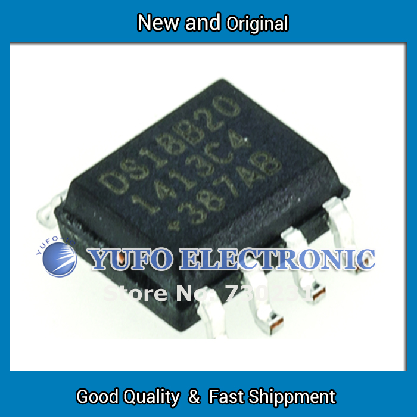 | |
| DS18B20 temperature with cable| 1   | 1.4        | [ebay](http://www.ebay.com/itm/331828375684) |  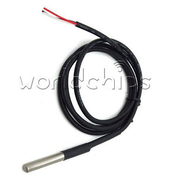 | |
| IRGS14C40LPBF - D2 pack       | 1   | 2.33       | [mouser](http://www.mouser.ch/ProductDetail/Infineon/IRGS14C40LPBF/?qs=%2fha2pyFaduiMeIrDGK3z7S3PcVt3Hpq4UFp3qznW7ubbN0dDgGLgLA%3d%3d) |
| Led Red 0805                  | 1   | 0.01       |                      |
| Power socket DC 5.5x2.5       | 1   | 0.2        | [aliexpress](https://www.aliexpress.com/item/Big-Discount-10pcs-DC-Power-Supply-Female-Jack-Socket-5-5-x-2-5mm-Barrel-Type/32406071366.html?spm=2114.30010308.3.2.fdXBrh&ws_ab_test=searchweb0_0,searchweb201602_3_10065_10068_10000009_10084_10083_10080_10082_10081_10060_10062_10056_10055_10037_10054_10059_10032_10099_10078_10079_10077_10000012_426_10103_10073_10102_10000015_10096_10052_10053_10107_10050_10106_10051,searchweb201603_1,afswitch_3_afChannel,single_sort_0_default&btsid=359acd27-d1e9-45e2-ac8a-c8276f44f4d0)                     |
| Resistor 1k 0805              | 4   | 0.01       |                      |
| Resistor 4.7k 0805            | 2   | 0.01       |                      |
| 3.5 mm male plug              | 1   | 0.1        | [ebay](http://www.ebay.com/itm/172001125871) | 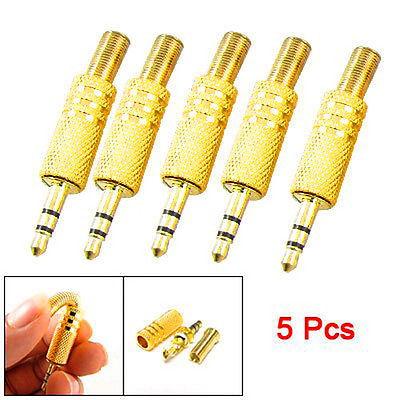 | |
| 3.5 Female jack PCB PF3024M   | 1   | 0.3        | [ebay](http://www.ebay.com/itm/331809367438) | 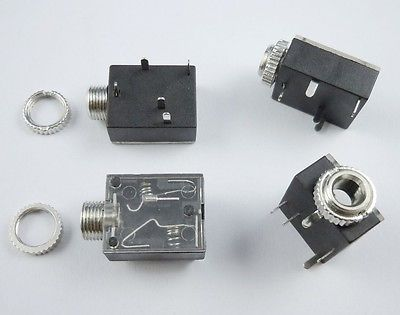 | |

## USB

| Denomination                  | Qty | Unit Price | Supplier             |
| ----------------------------- | --- | ---------- | -------------------- |
| Resistor 22 ohms 0805         | 2   | 0.01       |                      |
| USB mini PCB connector        | 1   | 0.05       | [ebay](http://www.ebay.com/itm/20-Pcs-Replacement-USB-Mini-5-Pin-Female-SMT-PCB-Mount-Jacks-LW-/171817138823?hash=item2801197a87:g:KUgAAOSwEgVWT4m-) |
| Capacitor 10 uF 0805          | 1   | 0.01       |                      |

## Food

| Denomination                  | Qty | Unit Price | Supplier             |
| ----------------------------- | --- | ---------- | -------------------- |
| Resistor 1k 0805              | 2   | 0.01       |                      |
| Resistor 10k 0805             | 2   | 0.01       |                      |
| Led Red 0805                  | 2   | 0.01       |                      |
| BSP75 SOT223                  | 2   | 0.3        | [aliexpress](https://www.aliexpress.com/item/Free-shipping-50pcs-lot-BSP75-BSP76-BSP77-SOT223/2026904236.html?spm=2114.30010308.3.10.m2zlgV&ws_ab_test=searchweb0_0,searchweb201602_3_10065_10068_10000009_10084_10083_10080_10082_10081_10060_10062_10056_10055_10037_10054_10059_10032_10099_10078_10079_10077_10000012_426_10103_10073_10102_10000015_10096_10052_10053_10107_10050_10106_10051,searchweb201603_1,afswitch_3_afChannel,single_sort_0_default&btsid=413c08f9-9370-41e8-b673-9b6507cf92a5) |  | |
| Header 2 pins  KF2510-2P      | 2   | 0.1        | [ebay](http://www.ebay.com/itm/251255708763) | 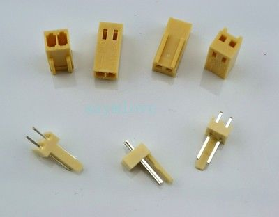 | |
| Cable 2 pins   KF2510-2P      | 2   | 0.5        | ebay | | |
| Peristaltic pumps             | 2   | 7          | [ebay](http://www.ebay.com/itm/201749015545?_trksid=p2057872.m2749.l2649&ssPageName=STRK%3AMEBIDX%3AIT) |   | |

## Weight

| Denomination                  | Qty | Unit Price | Supplier             |
| ----------------------------- | --- | ---------- | -------------------- |
| HX711 SOP16                   | 1   | 0.5        | [ebay](http://www.ebay.com/itm/182316289786) | 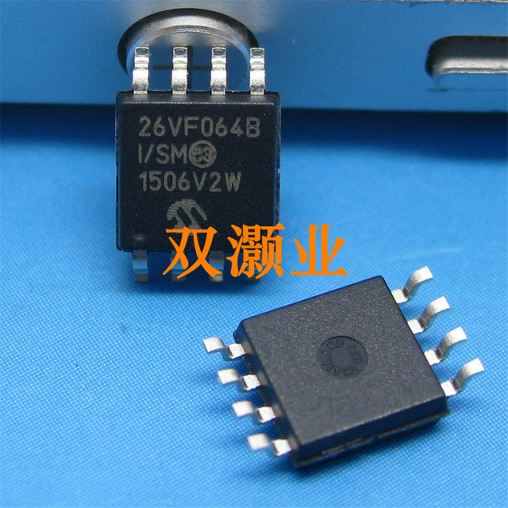 | |
| Load cell 2kg YZC-133         | 3   | 2.7        | [aliexpress](https://www.aliexpress.com/item/Electronic-2KG-YZC-133-Aluminum-Weighing-Weight-Scale-Sensor-Load-Cell/32660749913.html?spm=2114.13010608.0.0.vVBDFq) | 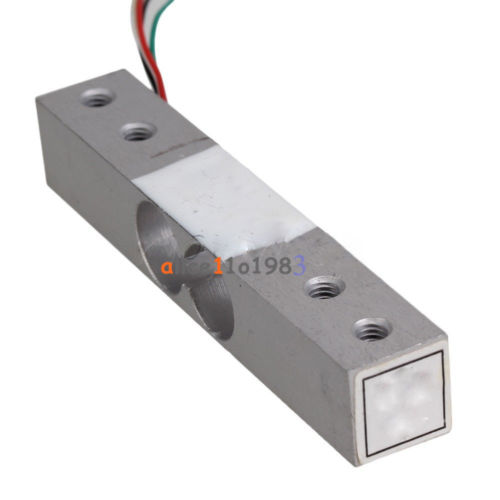 |
| Resistor 100 0805             | 2   | 0.01       |                      |
| Resistor 8.2k 0805            | 1   | 0.01       |                      |
| Resistor 10k 0805             | 1   | 0.01       |                      |
| Resistor 20k 0805             | 1   | 0.01       |                      |
| Capacitor 100 nF 0805         | 4   | 0.01       |                      |
| Capacitor 10 uF 0805          | 2   | 0.01       |                      |
| Transistor MMBT4403 SOT23-3   | 1   | 0.03       | [ebay](http://www.ebay.com/itm/100-PCS-MMBT4403-SOT-23-2N4403-SMD-PNP-transistor-/371086000069?hash=item566672ffc5:g:Gg8AAOSwBvNTouQY) |
| Header 5 pins  KF2510-5P      | 1   | 0.2   | | | |
| Cable 5 pins   KF2510-5P      | 1   | 0.6   |  |  | |

## LORA

| Denomination                  | Qty | Unit Price | Supplier             |
| ----------------------------- | --- | ---------- | -------------------- |
| Capacitor 100 nF 0805         | 1   | 0.01       |                      |
| Capacitor 10 uF 0805          | 1   | 0.01       |                      |
| Resistor 100k 0805            | 1   | 0.01       |                      |
| Microchip Lora RN2483         | 1   | 15         | [mouser](http://www.mouser.ch/ProductDetail/Microchip-Technology/RN2483-I-RM101/?qs=sGAEpiMZZMuI1aKsGLfKZOQCMfxWOhw5J%2fmjVNtRvb8%3d) |
| SMA Edge connector            | 1   | 0.3        | [ebay](http://www.ebay.com/itm/172409963484?_trksid=p2060353.m2749.l2649&ssPageName=STRK%3AMEBIDX%3AIT) |

## Stepper

| Denomination                  | Qty | Unit Price | Supplier             |
| ----------------------------- | --- | ---------- | -------------------- |
| Header 4 pins  KF2510-4P      | 1   | 0.3        |                      |
| Cable 4 pins   KF2510-4P      | 1   | 0.7        |                      |
| DRV8811 Motor driver          | 1   | 1          |                      |
| Resistor 47k 0805             | 2   | 0.01       |                      |
| Resistor 4.7k 0805            | 1   | 0.01       |                      |
| Resistor 3.3k 0805            | 1   | 0.01       |                      |
| Resistor 680 0805             | 1   | 0.01       |                      |
| Resistor 10k 0805             | 9   | 0.01       |                      |
| Resistor 0.2 1W 2010          | 2   | 0.6        |                      |
| Capacitor 220 nF 0805         | 3   | 0.01       |                      |
| Capacitor 100 nF 0805         | 6   | 0.01       |                      |
| Capacitor 1 nF 0805           | 2   | 0.01       |                      |
| Polarized capacitor 100 uF 50V PANASONIC_E| 1   | 0.8        |                      |
| Led Red 0805                  | 4   | 0.01       |                      |
| Nema 17 Unipolar Stepper 12v  | 1   | 15         | [stepperonline](http://www.omc-stepperonline.com/nema-17-unipolar-stepper-031a-158ncm224ozin-17hs130316s-p-65.html) | 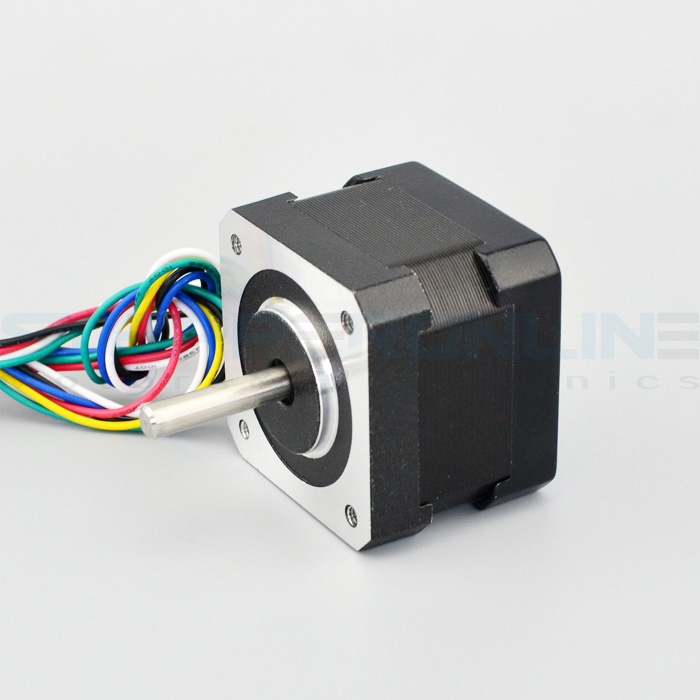 | |
| Round magnet 20 x 5mm         | 2   | 0.75       | [ebay](http://www.ebay.com/itm/20Pcs-N50-Super-Strong-Disc-Cylinder-Round-Magnets-20x5mm-Rare-Earth-Neodymium-/371778047624?var=&hash=item568fb2ce88:m:mIjauxTTiDkmOyNvGzp6vmw) | 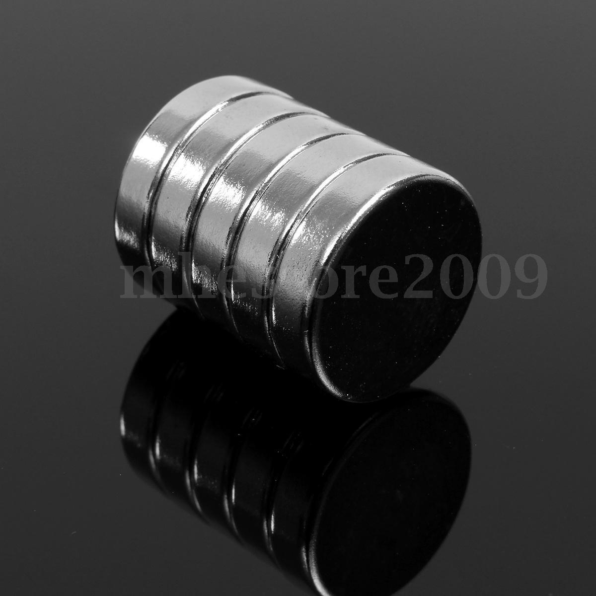 |

## Memory

| Denomination                  | Qty | Unit Price | Supplier             |
| ----------------------------- | --- | ---------- | -------------------- |
| SST26VF064B-104I/SM           | 1   | 2.0        | [aliexpress](https://www.aliexpress.com/item/SST26VF064B-I-SM-SST26VF064B-I-SST26VF064B-new-original/32760981168.html?spm=2114.13010608.0.0.vhdFdY) |  | |
| Resistor 10k 0805             | 2   | 0.01       |                      |
| Resistor 1k 0805              | 1   | 0.01       |                      |
| Capacitor 100 nF 0805         | 1   | 0.01       |                      |

## LCD

| Denomination                  | Qty | Unit Price | Supplier        | Image | Remarks |
| ----------------------------- | --- | ---------- | --------------- | ----- | ------- |
| Atmega32U4 44TQFP             | 1   | 3.6        | [aliexpress](https://www.aliexpress.com/item/10pcs-lot-ATMEGA32U4-AU-ATMEGA32U4-TQFP-44-IC-8-bit-Microcontroller-with-16-32K-Bytes-of/32720185776.html?spm=2114.13010608.0.0.Brw1qI) |  | |
| Capacitor 100 nF 0805         | 5   | 0.01       |                      |
| Capacitor 10 uF 0805          | 4   | 0.01       |                      |
| Capacitor 22 pF 0805          | 2   | 0.02       |                      |
| Crystal 16MHz 5032            | 1   | 0.25       |                      |
| Resistor 1M 0805              | 1   | 0.01       |                      |
| Resistor 10k 0805             | 4   | 0.01       |                      |
| Resistor 22 0805              | 2   | 0.01       |                      |
| Resistor 1k 0805              | 4   | 0.01       |                      |
| NCP1117LPST50T3G              | 1   | 0.6        |                      |
| Schottky 1N581 1206           | 2   | 0.03       | [ebay](http://www.ebay.com/itm/121381924838?_trksid=p2060353.m2749.l2649&ssPageName=STRK%3AMEBIDX%3AIT)|
| USB mini PCB connector        | 1   | 0.05       | [ebay](http://www.ebay.com/itm/20-Pcs-Replacement-USB-Mini-5-Pin-Female-SMT-PCB-Mount-Jacks-LW-/171817138823?hash=item2801197a87:g:KUgAAOSwEgVWT4m-) |
| FPC 8-pin 1mm AWM 20624       | 3   | 0.16       | [aliexpress](https://www.aliexpress.com/snapshot/7326978877.html?orderId=72887395416335&productId=32468149160)                |
| 12mm Rotary Encoder w switch  | 1   | 0.5        | [aliexpress](https://www.aliexpress.com/snapshot/7321568543.html?spm=2114.13010608.0.0.WuBkow&orderId=72780181866335&productId=32346748762)|
| LCD 20x4 HD44780 5v           | 1   | 4          | [ebay](http://www.ebay.com/itm/2004-204-20x4-Character-LCD-Display-Module-HD44780-Controller-Blue-Blacklight-/381374605432?hash=item58cbb2a878:g:urwAAOSwj0NUjt4w) |
| Flat cable 8-pin 1mm 20cm     | 2   | 0.3        | |

