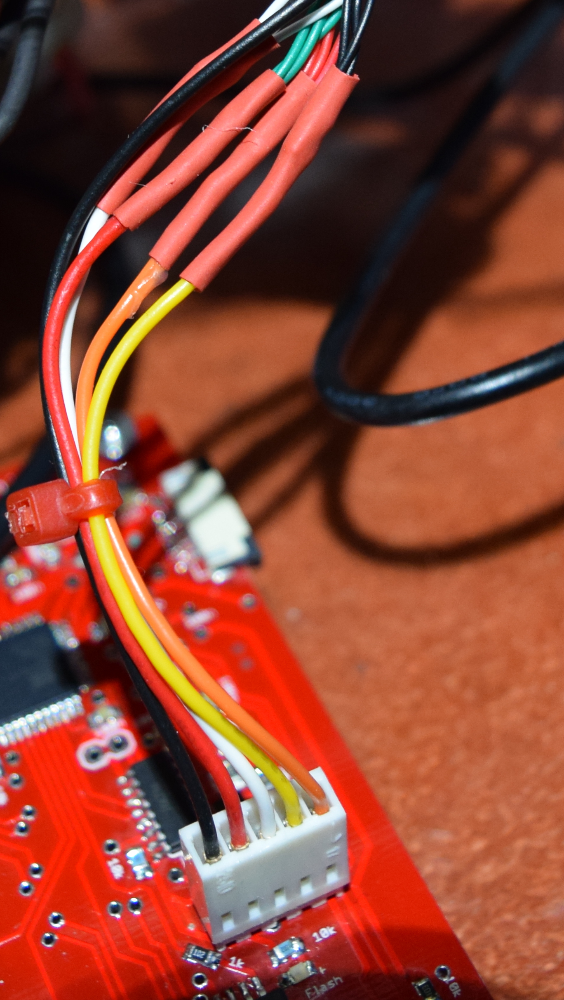

# Load cell

The weight is determined using 3 loading cells connected in parallel.

Those loading cells are connected to the main board through a 5 poles connector as shown in the
following picture

