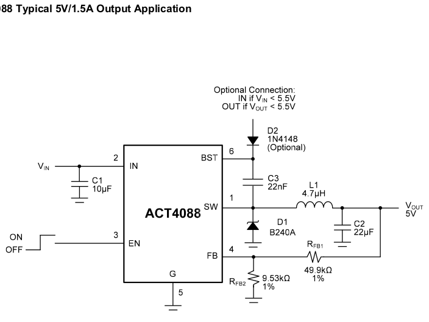
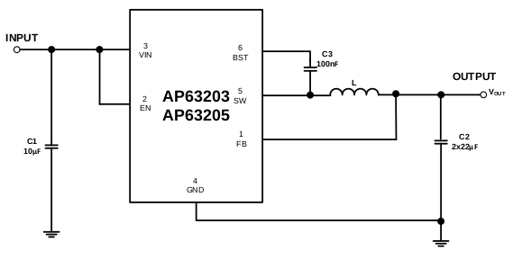

<table>
  <tr>
    <td colspan="9">
3.3 V Linear Voltage Regulator
</td>
  </tr>
  <tr>
    <td>Reference</td>
    <td>Price</td>
    <td>Mounting style</td>
    <td>Package</td>
    <td>Output current</td>
    <td>Output type</td>
    <td>Input voltage MAX</td>
    <td>Input voltage MIN</td>
    <td>URL Mouser</td>
  </tr>
  <tr>
    <td>TLS850B0TEV33ATMA1</td>
    <td>$1.56</td>
    <td>SMD/SMT</td>
    <td>TO-252-5</td>
    <td>500 mA</td>
    <td>Fixed</td>
    <td>40 V</td>
    <td>3 V</td>
    <td><a>https://co.mouser.com/ProductDetail/Infineon-Technologies/TLS850B0TEV33ATMA1?qs=W0yvOO0ixfGvA2FkIMPoCw%3D%3D</a></td>
  </tr>
  <tr>
    <td>TLS850B0TBV33ATMA1</td>
    <td>$1.56</td>
    <td>SMD/SMT</td>
    <td>TO-263-5</td>
    <td>500 mA</td>
    <td>Fixed</td>
    <td>40 V</td>
    <td>3 V</td>
    <td><a>https://co.mouser.com/ProductDetail/Infineon-Technologies/TLS850B0TBV33ATMA1?qs=W0yvOO0ixfF82ywpAVrG4Q%3D%3D</a></td>
  </tr>
  <tr>
    <td>LF33CDT-TRY</td>
    <td>$1.21</td>
    <td>SMD/SMT</td>
    <td>DPAK</td>
    <td>1 A</td>
    <td>Selectable</td>
    <td>16 V</td>
    <td>2 V</td>
    <td><a>https://co.mouser.com/ProductDetail/STMicroelectronics/LF33CDT-TRY?qs=fnYUjNMxfVBCqlsIwZoKRw%3D%3D</a></td>
  </tr>
  <tr>
    <td>LF33CPT-TRY</td>
    <td>$0.90</td>
    <td>SMD/SMT</td>
    <td>PPAK</td>
    <td>1 A</td>
    <td>Selectable</td>
    <td>16 V</td>
    <td>2 V</td>
    <td><a>https://co.mouser.com/ProductDetail/STMicroelectronics/LF33CPT-TRY?qs=fnYUjNMxfVCgWXVb%2F%2Fq9cQ%3D%3D</a></td>
  </tr>
  <tr>
    <td>IFX54441EJV33XUMA1</td>
    <td>$0.96</td>
    <td>SMD/SMT</td>
    <td>SOIC-8</td>
    <td>300 mA</td>
    <td>Fixed</td>
    <td>20 V</td>
    <td>1.8 V</td>
    <td><a>https://co.mouser.com/ProductDetail/Infineon-Technologies/IFX54441EJV33XUMA1?qs=3Bi3m9r5MQbEIEAqpFja2Q%3D%3D</a></td>
  </tr>
  <tr>
    <td>TLS202B1MBV33HTSA1</td>
    <td>$0.97</td>
    <td>SMD/SMT</td>
    <td>SCT-595-5</td>
    <td>150 mA</td>
    <td>Fixed</td>
    <td>18 V</td>
    <td>2.7 V</td>
    <td><a>https://co.mouser.com/ProductDetail/Infineon-Technologies/TLS202B1MBV33HTSA1?qs=0DP5yvOrqYkj%2FlQomcMjxg%3D%3D</a></td>
  </tr>
</table>

<table>
  <tr>
    <td colspan="10">
3.3 V Switching Voltage Regulator
</td>
  </tr>
  <tr>
    <td>Reference</td>
    <td>Price</td>
    <td>Mounting style</td>
    <td>Package</td>
    <td>Output Voltage</td>
    <td>Output current</td>
    <td>Topology</td>
    <td>Input voltage MAX</td>
    <td>Input voltage MIN</td>
    <td>URL Mouser</td>
  </tr>
  <tr>
    <td>MC33063ADR</td>
    <td>$0.44</td>
    <td>SMD/SMT</td>
    <td>SOIC-8</td>
    <td>1.25 V to 40 V</td>
    <td>1.5 A</td>
    <td>Buck, Boost, Inverting</td>
    <td>40 V</td>
    <td>3 V</td>
    <td><a>https://co.mouser.com/ProductDetail/Texas-Instruments/MC33063ADR?qs=paYhMW8qfisBLTp5LDV7jw%3D%3D</a></td>
  </tr>
  <tr>
    <td>MC33063ADRG4</td>
    <td>$0.44</td>
    <td>SMD/SMT</td>
    <td>SOIC-8</td>
    <td>1.25 V to 40 V</td>
    <td>1.5 A</td>
    <td>Buck</td>
    <td>40 V</td>
    <td>3 V</td>
    <td><a>https://co.mouser.com/ProductDetail/Texas-Instruments/MC33063ADRG4?qs=qRemG2J%252Bg%2FXFN3guMI86sg%3D%3D</a></td>
  </tr>
  <tr>
    <td>MC33063ADRE4</td>
    <td>$0.44</td>
    <td>SMD/SMT</td>
    <td>SOIC-8</td>
    <td>1,25 V to 40 V</td>
    <td>1.5 A</td>
    <td>Buck, Boost, Inverting</td>
    <td>40 V</td>
    <td>3 V</td>
    <td><a>https://co.mouser.com/ProductDetail/Texas-Instruments/MC33063ADRE4?qs=paYhMW8qfivX0WvoszhiKw%3D%3D</a></td>
  </tr>
  <tr>
    <td>AZ34063UMTR-G1</td>
    <td>$0.47</td>
    <td>SMD/SMT</td>
    <td>SOIC-8</td>
    <td>1,25 V to 40 V</td>
    <td>1.5 A</td>
    <td>Buck, Boost, Inverting</td>
    <td>36 V</td>
    <td>3 V</td>
    <td><a>https://co.mouser.com/ProductDetail/Diodes-Incorporated/AZ34063UMTR-G1?qs=FKu9oBikfSmOGMlC%2Fa3O3g%3D%3D</a></td>
  </tr>
  <tr>
    <td>TS34063CS RLG</td>
    <td>$0.55</td>
    <td>SMD/SMT</td>
    <td>SOP-8</td>
    <td></td>
    <td>1.5 A</td>
    <td>Boost, Buck</td>
    <td>40 V</td>
    <td>3 V</td>
    <td><a>https://co.mouser.com/ProductDetail/Taiwan-Semiconductor/TS34063CS-RLG?qs=5aG0NVq1C4y6oaiEskoR6w%3D%3D</a></td>
  </tr>
  <tr>
    <td>MC34063ADG</td>
    <td>$0.58</td>
    <td>SMD/SMT</td>
    <td>SOIC-8</td>
    <td>Adjustable</td>
    <td>1,5 A</td>
    <td>Boost, Buck</td>
    <td>40 V</td>
    <td>3 V</td>
    <td><a>https://co.mouser.com/ProductDetail/ON-Semiconductor/MC34063ADG?qs=dFKnUM%2FquJZW6wgkYyuruw%3D%3D</a></td>
  </tr>
  <tr>
    <td>AL8811M8-13</td>
    <td>$0.75</td>
    <td>SMD/SMT</td>
    <td>MSOP-8</td>
    <td>Adjustable</td>
    <td>1.6 A</td>
    <td>Buck, Boost, Inverting</td>
    <td>20 V</td>
    <td>3 V</td>
    <td><a>https://co.mouser.com/ProductDetail/Diodes-Incorporated/AL8811M8-13?qs=QbteAPZ0mr2FDgYVdyLanA%3D%3D</a></td>
  </tr>
  <tr>
    <td>AP63201WU-7</td>
    <td>$0.82</td>
    <td>SMD/SMT</td>
    <td>TSOT-26-6</td>
    <td>Adjustable</td>
    <td>2 A</td>
    <td>Buck</td>
    <td>32 V</td>
    <td>3.8 V</td>
    <td><a>https://co.mouser.com/ProductDetail/Diodes-Incorporated/AP63201WU-7?qs=u16ybLDytRaVD%252BU3eG30NA%3D%3D</a></td>
  </tr>
  <tr>
    <td><b>AP63203WU-7</b></td>
    <td>$0.83</td>
    <td>SMD/SMT</td>
    <td>TSOT-26-6</td>
    <td>3,3 V</td>
    <td>2 A</td>
    <td>Buck</td>
    <td>32 V</td>
    <td>3.8 V</td>
    <td><a>https://co.mouser.com/ProductDetail/Diodes-Incorporated/AP63203WU-7?qs=u16ybLDytRZ1JqxbuLkMJw%3D%3D</a></td>
  </tr>
  <tr>
    <td><b>ACT4088US-T</b></td>
    <td>$0.27</td>
    <td>SMD/SMT</td>
    <td>SOT-23-6</td>
    <td>5 V</td>
    <td>1,5 A</td>
    <td>Buck</td>
    <td>28 V</td>
    <td>4.5 V</td>
    <td><a>https://co.mouser.com/ProductDetail/Qorvo/ACT4088US-T?qs=%2Fha2pyFaduj3zC6esU%2F8%252BfzWZ4716qD%252Byca2A%252BeLaTI%3D</a></td>
  </tr>
</table>

ACT4088
===

BOM
---

| Component | Package | Price |
| --- | --- | --- |
| C1 | 0805 | $ 0.14 |
| C2 | 0805 | $ 0.81 |
| C3 | 0805 | $ 0.10 |
| D1 | DO-214-2 | $ 0.47 |
| D2 | SOD-323 | $ 0.14 |
| L1 | 1007 | $ 0.17 ($ 0.38) |
| RFB1 | 0805 | $ 0.10 |
| RFB2 | 0805 | $ 0.11 |
| ACT4088US | SOT-23-6 | $ 0.27 |

Total cost = $ 2.31 ($ 2.52)

AP63203
===

BOM
---

| Component | Package | Price |
| --- | --- | --- |
| C1 | 0805 | $ 0.14 |
| C21 | 0805 | $ 0.81 |
| C22 | 0805 | $ 0.48 |
| C3 | 0805 | $ 0.10 |
| L1 | 6x6 mm | $ 0.35 |
| AP63203WU | TSOT-26-6 | $ 0.83 |

Total cost = $ 2.71
